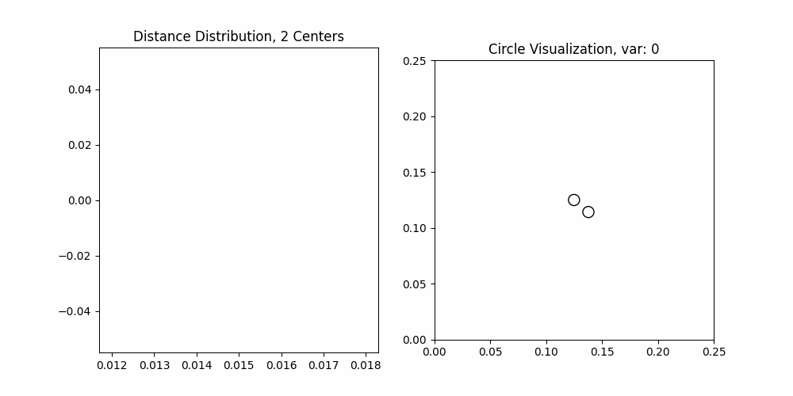

# Circle
Add circles with "uniform nearest-neighbor distance"

## Description

There is a question: how to add circles with "uniform nearest-neighbor distance" in a given area? So far, this response used BFS to generate the circles. But it is not efficient. So I tried to use a new method to generate the circles.

The process is as follows:

